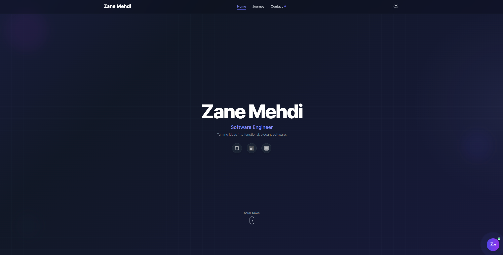

# Zane Mehdi - Personal Portfolio

A modern, interactive personal portfolio website showcasing my journey as a Software Engineer. Built with cutting-edge web technologies and featuring an AI-powered chat assistant for an engaging user experience.



## ✨ Features

### 🎨 **Modern Design & Animations**
- Beautiful animated hero section with floating orbs and gradient backgrounds
- Smooth page transitions with Framer Motion
- Interactive spotlight effect that follows mouse movement
- Responsive dark/light theme with seamless switching
- Custom cursor effects on desktop
- Optimized animations for mobile devices

### 🤖 **AI-Powered Chat Assistant**
- Interactive chat interface powered by AI
- Context-aware responses about my work, skills, and projects
- Real-time conversation with typing indicators
- Floating contact button with animated notifications
- Fallback to direct contact options

### 📱 **Responsive & Accessible**
- Mobile-first responsive design
- Optimized performance across all devices
- Accessible navigation with keyboard shortcuts
- Command palette (⌘K / Ctrl+K) for quick navigation
- Proper semantic HTML and ARIA labels

### 🚀 **Dynamic Content**
- Live GitHub activity feed
- Interactive project showcase with modal details
- Work history timeline with detailed descriptions
- Skills section with animated technology icons
- Downloadable CV/Resume with preview

### ⚡ **Performance Optimized**
- Lazy loading for images and components
- Debounced scroll and resize handlers
- Memoized components to prevent unnecessary re-renders
- Optimized bundle size with code splitting
- Fast loading times with Vite

## 🛠️ Tech Stack

### Frontend
- **React 18** - Modern React with hooks and functional components
- **Framer Motion** - Advanced animations and page transitions
- **Vite** - Lightning-fast development and build tool
- **TailwindCSS** - Utility-first CSS framework

### Backend (AI Chat)
- **Node.js** - Runtime environment for chat API
- **Express.js** - Web framework for API endpoints
- **AI Integration** - Context-aware chat responses
- **Netlify Functions** - Serverless deployment

### External APIs
- **GitHub API** - Live activity feed
- **Custom AI API** - Intelligent chat responses

## 🚀 Getting Started

### Prerequisites
- Node.js (v16 or higher)
- npm or yarn package manager

### Installation

1. **Clone the repository**
   ```bash
   git clone https://github.com/zane-mehdi/portfolio.git
   cd portfolio
   ```

2. **Install dependencies**
   ```bash
   npm install
   ```
   
3. **Start the development server**
   ```bash
   npm run dev
   ```
## 🤝 Contributing

1. Fork the repository
2. Create a feature branch (`git checkout -b feature/amazing-feature`)
3. Commit your changes (`git commit -m 'Add amazing feature'`)
4. Push to the branch (`git push origin feature/amazing-feature`)
5. Open a Pull Request

## 📄 License

This project is licensed under the MIT License - see the [LICENSE](LICENSE) file for details.

## 🙏 Acknowledgments

- [Framer Motion](https://www.framer.com/motion/) for beautiful animations
- [TailwindCSS](https://tailwindcss.com/) for rapid styling
- [React](https://reactjs.org/) for the component architecture
- [Vite](https://vitejs.dev/) for lightning-fast development
- [GitHub API](https://docs.github.com/en/rest) for live activity feed

## 📞 Contact

- **Email**: zanemehdi6@gmail.com
- **LinkedIn**: [linkedin.com/in/zane-mehdi](https://www.linkedin.com/in/zane-mehdi/)
- **GitHub**: [github.com/Zane-Mehdi](https://github.com/Zane-Mehdi)

---

**Built with ❤️ by Zane Mehdi**